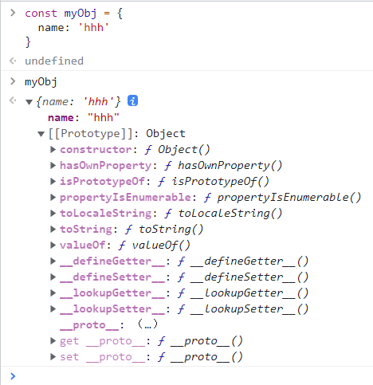

# 原型和原型链

## 用自己的话说一说原型及原型链

Js可以说是基于原型的语言，每个对象都拥有一个原型对象，对象以这个原型为模板、从原型继承方法以及属性。**每一个可构造函数都有一个原型对象**，这个原型对象的constructor是指向当前可构造函数的引用。这个原型对象也可以称为当前构造函数的显式原型

除此之外，js每个对象都有一个特殊的内置属性[[prorotype]],这个属性通常被称为当前对象的隐式原型-指向当前对象的构造函数的显式原型prototype

基于当前对象的隐式原型指向其构造函数的显式原型，原型链应运而生

## 原型

- 显式原型：prototype
  - 每个函数都会创建一个prototype属性对象，包含对象实例共享的属性和方法
- 隐式原型：\_\_proto\_\_
- 普通对象：没有显式原型



## 原型链

- 当谈到继承时，JavaScript 只有一种结构：对象
- 每个实例对象（object）都有一个私有属性（\_\_proto\_\_)指向它的构造函数的原型对象（prototype）.
- 该原型对象也有一个自己的原型对象( \_\_proto\_\_ ) ，层层向上直到一个对象的原型对象为 `null`。根据定义，`null` 没有原型，并作为这个**原型链**中的最后一个环节。

## Class

- 在ES6中引入了class关键字，但只是语法糖，js仍然是基于原型的。


## 继承的四种方式

#### 类的创建

 ES5:

1.利用function关键字和this关键字

2.原型方法

3.利用Object.create()方法构造


1.利用function关键字和this关键字*

```javascript
//定义一个动物类*

function Animal(**name**) {

 *this***.***name* **=** name; *//属性*

 *this***.**sleep **=** function() {  *//实例方法*

  console**.**log(*this***.***name* **+** 'sleep...');

 }

}

*//在原型链上添加一个原型方法*

Animal**.**prototype**.**eat **=** function(**food**) {

 console**.**log(*this***.***name* **+** ' eat...' **+** food)

}


*//使用*

var animal**=new** Animal('animal');

animal**.**eat('banana');
```


*// 3.利用Object.create()方法构造*

```javascript
const User **=** {

  name:'hello',

  getName:function(){

​    **return** *this***.***name*;

  }

}


*//使用*

var user**=***Object***.**create(User);

console**.**log(user**.**getName());


```


*/**类的继承*

 ** 1.原型链继承*

 ** 2.构造继承*

 ** 3.组合继承*

 ** 4.寄生组合继承*

**/*

#### 原型链继承

不能实现多继承

```javascript
function Cat(){

 //创建一个空对象

}

Cat.prototype = new Animal();

Cat.prototype.name = 'cat';

var cat =new Cat;

cat.eat('fish');
```


#### *构造继承.*

*// 特点：可以实现多继承。*

*// 缺点：只能实现继承父类的属性和方法，*

*//  不能继承原型链上的属性和方法。*

```javascript
function Dog(){

 Animal**.**call(*this*);

 *this***.***name* **=** 'Dog';

 console**.**log(*this*);

}

var dog **=** **new** Dog;

*// dog.eat();// dog.eat is not a function
```


#### *组合继承.*

*// 缺点：调用了两次父类构造函数，生成了两份实例。*

```javascript
function Tiger(){

 Animal**.**call(*this*);

 *this***.***name* **=** 'tiger';

}

Tiger**.**prototype **=** **new** Animal();

Tiger**.**prototype**.**constructor **=** Tiger;

var tiger **=** **new** Tiger();

tiger**.**eat('meat');
```


#### *寄生组合继承*

```javascript
function Rabbit() {

 Animal**.**call(*this*,'rabbit1');

 *// this.name = 'rabbit'*

}

(function() {

 var Super **=** function() {};

 Super**.**prototype **=** Animal**.**prototype;

 Rabbit**.**prototype **=** **new** Super();

})()

var rabbit **=** **new** Rabbit();

rabbit**.**eat('萝卜');
```

