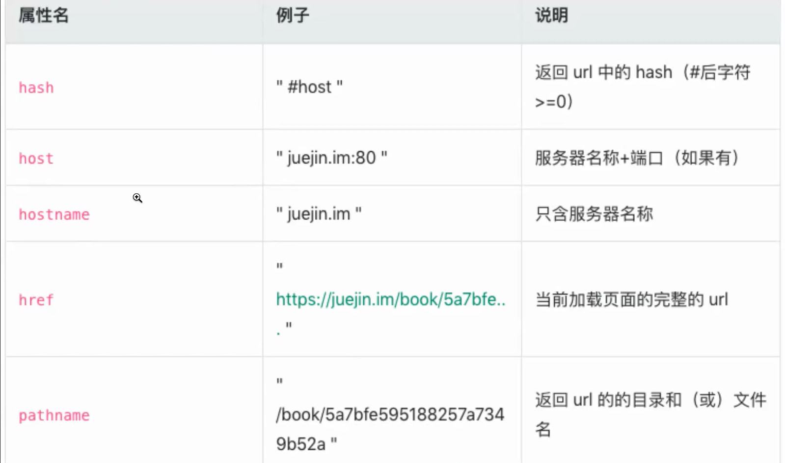

---

---

# 浏览器内置对象

### 浏览器内置对象：BOM

window 对象、location 对象、navigation 对象、screen 对象、history 对象

#### window

- js 访问浏览器的接口

- 等同ES规定的Global对象

- 窗口位置

  screenLeft
  screenTop
  screenX	
  screenY	
  moveBy(x,y)
  moveTo(x,y)

- 窗口大小

  innerWidth
  innerHeight	

  outerWidth
  outerHeight	

  ```
  // 兼容
  window.innerWidth || document.body.clientWidth
  ```

  

  

  resizeTo(width, height)
  resizeBy(width, height)

- 定时器

  setTimeout
  setInterval


#### location

- 文档相关信息、导航信息

- window.location = document.location




#### navigation

- 浏览器系统信息


#### screen

- 浏览器窗口外部的显示器信息


#### history

- 用户上网信息


# 浏览器事件模型

#### 浏览器事件捕获、冒泡

- 事件委托、事件代理
  - 捕获阶段
  - 目标阶段
  - 冒泡阶段
  - e.target.nodeName 点击的当前元素（最底层）；
  - e.currentTarget.nodeName 事件的绑定元素
  - addEventListener第三个参数为true则绑定的是捕获阶段


- 阻止时间传播
  - e.stopPropagation() 不仅可以阻止事件的冒泡，也可以阻止捕获
- 兼容
  - attachEvent——兼容：IE7、IE8； 不支持第三个参数来控制在哪个阶段发生，默认是绑定在冒泡阶段
  - addEventListener——兼容：firefox、chrome、IE、safari、opera；

# 浏览器请求相关

#### ajax/fetch

1. XMLHTTPRequest

   先监听，再请求

   - xhr.open
   - xhr.onreadystatechange
     - readyState     4 还没完成
     - readyState     200 完成

   - xhr.timeout
   - xhr.ontimeout = () => {}
   - xhr.upload.onprogress 大文件的上传...长请求...
   - xhr.send

2. fetch

```
fetch('http://demo/service',{
	method: 'GET'
}).then(response => {
	if(response.ok){
		// 请求成功
		return response.json();
	}
	throw new Error('http error');
}).then(json => {
	console.log(json)
}).catch(error => {
	console.log(error)
})

// 手动设置超时
function fetchTimeout(url, init, timeout = 3000){
	return new Promise((res, rej) => {
		fetch(url, init).then(res).catch(reject);
		setTimeout(reject, timeout)
	})
}
```

- 默认不带cookie
- 错误不会reject
- 不支持超时设置
- 需要借用AbortController中止fetch


#### 为什么CDN域名和业务域名不一样

- 会携带cookie, 不希望cookie传给CDN厂商/增加了请求消耗


#### access-control-arrow-origin

- 跨域设置

#### content-encoding: gzip


## 针对spa应用的html文件，要做什么缓存

协商缓存

一般不做缓存